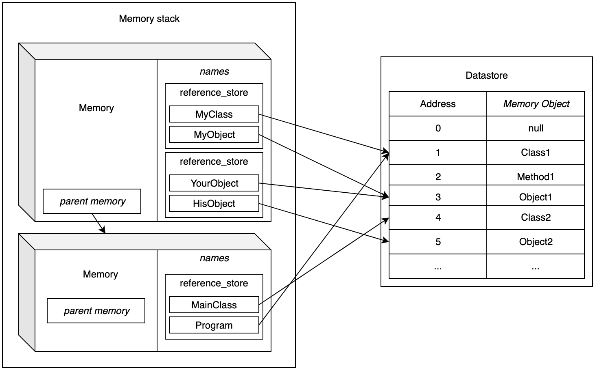

Minijava compiler Javabien
===========================

> The minijavac compiler.
>
> A compilation project for Third year students of Telecom Bretagne.
>
> 'ocamlbuild Main.byte' (or native) to build the compiler. The main file
> is Main/Main.ml, it should not be modified. It opens the given file,
> creates a lexing buffer, initializes the location and call the compile
> function of the module Main/compile.ml. It is this function that you
> should modify to call your parser.
>
> 'ocamlbuild Main.byte -- <filename>' (or native) to build and then execute
> the compiler on the file given. By default, the program searches for
> file with the extension .java and append it to the given filename if
> it does not end with it.
>
> If you want to reuse an existing ocaml library. Start by installing it
> with opam. For example, to use colored terminal output you
> use 'opam install ANSITerminal'.
> Then you must inform ocamlbuild to use the ocamlfind tool:
> `ocamlbuild -use-ocamlfind Main.byte -- tests/UnFichierDeTest.java`
> and you must modify your `_tags` file to declare the library:
> true: package(ANSITerminal)
>
> The Lexer/Parser is incomplete but should be ok for phase2. It
> contains a remaining conflict: a conflict between expression and
> declaration of variable in statements that could be solved at the
> price of a much more complex grammar... Here the behavior of choosing
> shift should be ok.

------

## Quickstart

The project can be quickly built with the provided [Makefile](Makefile):

Build the Main binary:
```bash
make
```

Some toy programs are available under the [Test/programs/](Test/programs/)
folder they should all run with the Javabien compiler, but not necessary with
javac compiler.

```bash
# HelloWorld
./Main.byte Test/programs/HelloWorld.java

# Implementation of a stack using a linked list:
./Main.byte Test/programs/Stack.java

# Program that does a linear regression on a given method:
./Main.byte Test/programs/LinearRegression.java

# Reimplementation of the `cat` gnu util:
./Main.byte Test/programs/Cat.java README.md Makefile

# Simple HttpServer that serves the content of a folder
./Main.byte Test/programs/HttpServer.java 8000 ~/mywebsite

# See Test/programs/ for the full list
```

## Tests

Run crafted test suite:
```bash
make test-all
```

To pin-point a specific problem, tests can be run individually, the list of
available tests recipes are available using the following command:
```bash
make test-list
```

## Design notes

### Memory management

#### Presentation

For each program the interpreter creates a stack of memory which allow the
java program to store and retrieve variables. A memory is built around three
main structures:

- The `data_store`: This is an unstructured key-value map that associate an
  arbitrary key to a memory object. That object can be a Java object, a Java
  class, a Java variable, a method, a Java array...
- The `reference_store`: this structure specifies the association between a Java
  name (class name, object name...) with an identifier in the `data_store`.
  This structure defines if a variable is in scope or not.
- The `names`: which is essentially a stack of `reference_stores`

Both structures are built around an Ocaml Hashtbl, and the implementation is
done in a module details located in the in the
[Utils/Memory.ml](Utils/Memory.ml) file.

In order to define scopes for variables, the `names` is built as a stack of
`reference_stores`, when the program enters a new bloc, a new `reference_store`
is pushed on top of the stack and all new variables names will be referenced
there.

When searching for a name in scope, the function `Memory.get_address_from_name`
will look through each `reference_store` in the `names` stack starting from the
top. We call this `names` stack a transparent stack as it can be written only
on top but it can be peaked through.

In order to handle function call, we create another stack of `names` that is
opaque: only the top item can be written and read. In short, the memory model
can be summarized using the following diagram:


The following diagram illustrate an example of memory binding:



#### Garbage collection

The garbage collection is made by building a seen/not seen tree of objects with
the memory stacks as root. We iterate on each name in the stacked memories and
`reference_store`s and set an object as seen or not seen. Once this pass is
done each object in the `data_store` that is not marked as seen is deleted.

This method is slow and have a complexity around O(N) with N equal to the
number of objects in the datastore but is good enough for our use case.

The garbage collector is called at every block return, this heuristic can be
much more improved but we stuck with it.

#### Performance notices

This memory model has one main caveat: for each memory object retrieved,
created or modified we need to make an indirection from the `names` store to
the `data_store`. This can lead to some penalties.

This is even worse for Arrays in which each element of an array is a reference
to an object in the `data_store`. In which case, iterating over an array
require resolving each object which are not necessarily stored in continuous
parts of the memory.

### Natives and stdlib

When starting a program, the interpreter will load into memory an environment
of existing classes. Those classes are described in the `stdlib/` folder.
We tried to follow the jdk classes, but they are nowhere as complete as the
jdk.

In order to handle such classes, we have implemented the Java method modifier:
`native`. When a `native` method is met, the interpreter will search in an
Hashtbl if the method is not referenced in Ocaml.

One example of Class with native methods is the `Debug` class which is used to
debug the interpreter. The static java method `Debug.dumpMemory()` will print
the state of the program memory in place. The static java method
`Debug.debug(var)` will print a java name as it is seen in memory. Both methods
can be used anywhere in a program.

### Typing tests

There are two recipes dedicated to the typing suite:
* `make test-ShouldWorkTypeTest.byte`: this suite will try to type the files
  located in the `Test/typing/should_work` folder and verify that every file
  here are correctly typed.
* `make test-ShouldFailTypeTest.byte`: this suite will try to type the files
  located in the `Test/typing/should_fail` folder and check that each file
  fail the typing phase, however it will not check _why_ the test failed.

### Evaluation tests

Using the recipe `make test-EvalUnitTest.byte` it is possible to run a unit
test suite against a list of files located in the `Test/eval_units/` folder.
These tests will check that the outputs of `Debug.debug(Object o)` matches with
the comment lines starting with `//:` located at the top of the file. For
example the following test will pass:

```java
//: 1

class Main {
        static void main() {
                Debug.debug(1);
        }
}
```

While the following one will fail
```java
//: 5

class Main {
        static void main() {
                Debug.debug(1);
        }
}
```

This test suite allows us to verify that the output of a script matches the
expected one.

To launch a specific unit test, the `main-class` argument can be used:
```bash
./Main.byte -skip-tc -main-class Main Test/eval_units/000_VarDeclaration.java
```

## Features implemented

Here are the lists of features that we planned and/or implemented. We do not
aim to implement them all but this list works well as a TODO list of features
we might want to integrate in JavaBien.

### AST evaluation

#### Primitives
* [x] Primitives types
  * [x] int
  * [x] bool
  * [x] float
  * [x] double
  * [x] Char
  * [x] String
* [x] Simple arithmetic operations
* [x] Simple logic operations
* [x] Postfix operations
* [x] Prefix operations
* [x] Variable declaration
* [x] Variable assignation (only `Assign`)
* [x] null element
* [x] Arrays
  * [x] Creation
  * [x] Assignation
  * [x] Element access
* [ ] Casting
* [ ] Exceptions
* [ ] Object unboxing

#### Class language
* [x] Class declaration
* [x] Method declaration
* [x] Attributes declaration
* [x] Attribute Access
* [x] Static Attribute declaration
* [x] Static Attribute Access
* [ ] Inheritance
* [x] Native Method declaration
* [x] Custom class constructor
* [ ] Subclasses

#### Control flow
* [x] If, else if, else
* [x] Block
* [x] while loop
* [x] For loop
* [x] Method call
* [x] Method return
* [ ] Method overload
* [ ] Inheritance

#### Memory
* [x] Simple memory heap
* [x] Simple memory stack
* [x] Unnamed pointers
* [x] Garbage collection

#### System
* [x] File open, read, write
* [x] Socket create, bind, accept, read, write

#### Other
* [x] Inline printing
* [x] Inline memory dump
* [x] Program arguments
* [x] Simple STD
* [ ] Threads and multithreading control
* [ ] Imports
* [ ] Informative errors

### Type checking

You can find a non-exhaustive list of the `compile-time errors` cases specified by the specification in the file [TypeErrors](./TypeErrors.md) and whether we handle them or not. Note that this file may not be up to date with our current implementation.

Our type-checking environment uses two `HashTbl` (the one provided in [Utils/Env.ml](Utils/Env.ml)). It is defined as:
```ocaml
{
    classes_env = classes_env;
    exec_env = Env.initial();
    current_class = "";
    current_method = None
}
```

- `classes_env` is a HashTbl where classes info is stored as `javaclass` with their name as key. This Class environment is populated in [TypingEnv](Typing/TypingEnv.ml]. When populating the environment, some checks are done on different things like modifiers combination for instance.

- The `exec_env` contains the environment of the method that is being checked, as `string`,`type` pairs, each pair corresponding to a local variable, the `string` being its name and the `type` its type.

- `current_class` is the name of the class being checked.

- `current_method` is the `javamethod` (see in [Typing/TypingEnv.ml](Typing/TypingEnv.ml)) being checked.

In [Typing/TypeExcept.ml](Typing/TypeExcept.ml) you will find the different exceptions that are raised in a case where a compile-time error should occur.

We have not implemented type checking for the `Throw` and `Try` statements. As for expressions, we do not handle *casts*, *condop* and *classof*.

We do not handle the `static` contexts and accesibility for the classes. We handle basic *inheritance* and `private` attributes.


## Parser bugs and fixes

We have noticed some errors in the built AST, they are listed below and are
fixed when we needed. Some patches might be merged back upstream for next
years.

- b = true && true; (also <= < > >=)
This doesn't respect operators’ precedence.
AST:
```
Expression
└─ Op
   ├─ Expression
   │  └─ AssignExp
   │     ├─ Expression
   │     │  └─ Name
   │     │     └─ b
   │     ├─ =
   │     └─ Expression
   │        └─ Val
   │           └─ Boolean
   │              └─ true
   ├─ &&
   └─ Expression
      └─ Val
         └─ Boolean
            └─ true
```

Expected AST:
```
Expression
└─ AssignExp
   ├─ Expression
   │  └─ Name
   │     └─ b
   ├─ =
   └─ Expression
      └─ Op
         ├─ Expression
         │  └─ Val
         │     └─ Boolean
         │        └─ true
         ├─ &&
         └─ Expression
            └─ Val
               └─ Boolean
                  └─ true
```

- ~~int notseenasanarray[]; this should be of type int[]. But int[] array; works~~ Fixed in 386aa089a259ed950709cd292c15254a9872b851

```
AstAttribute
├─ Modifiers :
├─ notseenasanarray
├─ int
└─ none
```

- ~~two[] = one; This should not be parsed; The expression between [] should be mandatory~~ Fixed in 386aa089a259ed950709cd292c15254a9872b851

- ~~one = two[]; Same as above~~ Fixed in 386aa089a259ed950709cd292c15254a9872b851

- ~~emptyInit = new int[][1][]{1, 2}; This should not be parsed. Even -v output is wrong~~ Fixed in 88aa9f0265a5274cef0a1768755d673411428791
```
input:
arr = new int[2][][4]{3, 4};

-v output:
arr = {3,4}.int[2][][4];
```

- ~~Char literal are not parsed correctly~~ Fixed in 5475cacae3030bd5bc3c96b0b3387fb2038f475a (not fixed: escaped chars like `\n`)
